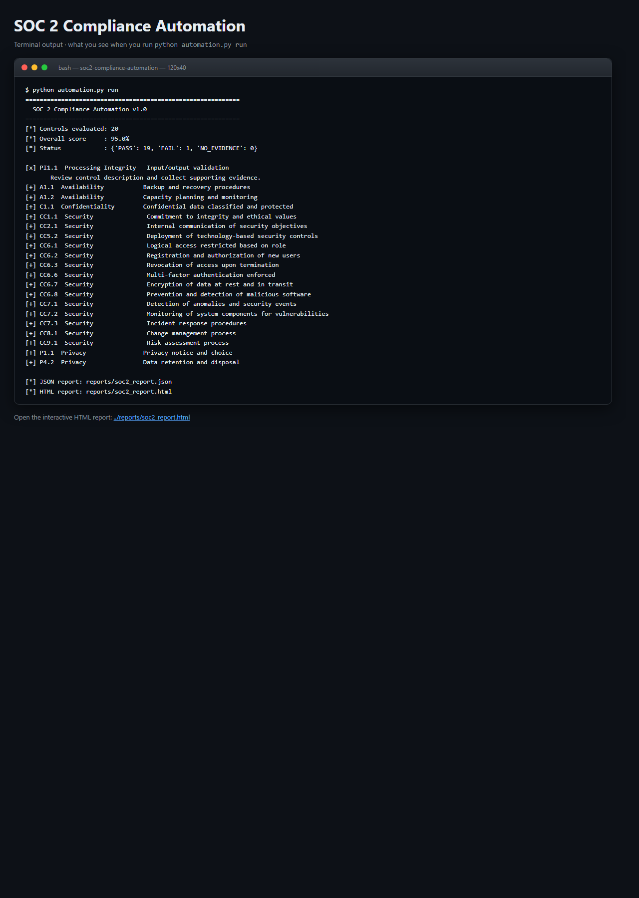
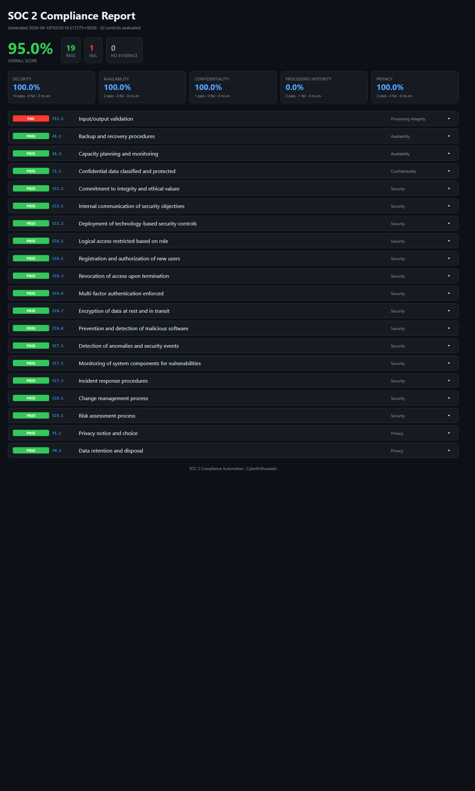

# SOC 2 Compliance Automation

> **Automated SOC 2 Trust Services Criteria controls with evidence hashing and gap reports - ISO 27001 and NIST CSF cross-mapped, zero dependencies.**
> A free, self-hosted alternative to Vanta, Drata, and Secureframe for teams that want SOC 2 readiness without the enterprise price tag.

[](./LICENSE)
[](https://www.python.org/downloads/)
[](https://www.aicpa.org/)
[](https://www.iso.org/isoiec-27001-information-security.html)
[](https://www.nist.gov/cyberframework)

---

## What it does (in one screenshot of terminal output)

```
============================================================
  SOC 2 Compliance Automation v1.0
============================================================
[*] Controls evaluated: 20
[*] Overall score     : 95.0%
[*] Status            : {'PASS': 19, 'FAIL': 1, 'NO_EVIDENCE': 0}

[+] CC6.6  Security               Multi-factor authentication enforced
[+] CC6.7  Security               Encryption of data at rest and in transit
[+] CC6.3  Security               Revocation of access upon termination
[+] CC7.1  Security               Detection of anomalies and security events
[+] CC7.3  Security               Incident response procedures
[x] PI1.1  Processing Integrity   Input/output validation
       Review control description and collect supporting evidence.
...
```

And opens an interactive dark-mode HTML report: big overall-score headline number, per-category score tiles, per-control drill-down with evidence hash + TSC/ISO/NIST cross-map + remediation hints.

---

## Screenshots (ran locally, zero setup)

**Terminal output** - exactly what you see on the command line:



**Interactive HTML dashboard** - opens in any browser, dark-mode, filterable:



Both screenshots are captured from a real local run against the bundled `samples/` directory. Reproduce them with the quickstart commands below.

---

## Why you want this

| | **SOC 2 Compliance Automation** | Vanta | Drata | Secureframe | Tugboat Logic |
|---|---|---|---|---|---|
| **Price** | Free (MIT) | $$$$/year | $$$$/year | $$$$/year | $$$/year |
| **Runtime deps** | **None** - pure stdlib | SaaS | SaaS | SaaS | SaaS |
| **Own your data** | Yes (local files) | Exported | Exported | Exported | Exported |
| **Trust Services Criteria coverage** | 20 controls (expandable) | Full | Full | Full | Full |
| **ISO 27001 cross-map** | Yes | Yes | Yes | Yes | Yes |
| **NIST CSF cross-map** | Yes | Partial | Yes | Partial | Yes |
| **Evidence hashing for tamper-evidence** | Yes (SHA-256) | Yes | Yes | Yes | No |
| **Offline / air-gapped** | Yes | No | No | No | No |
| **Extend with Python** | 10 lines | Workflow builder | Workflow builder | No | No |
| **Interactive HTML report** | Bundled | Dashboard | Dashboard | Dashboard | Dashboard |

---

## 60-second quickstart

```bash
# 1. Clone
git clone https://github.com/CyberEnthusiastic/soc2-compliance-automation.git
cd soc2-compliance-automation

# 2. Run the sample evidence (ships with the repo)
python automation.py run

# 3. Open the HTML report
start reports/soc2_report.html       # Windows
open  reports/soc2_report.html       # macOS
xdg-open reports/soc2_report.html    # Linux
```

### Alternative: one-command installer

```bash
./install.sh        # Linux/Mac/WSL/Git Bash
.\install.ps1       # Windows PowerShell
```

---

## What it covers (20 controls across all 5 TSC categories)

### Security (14 controls - CC series)

| ID | Control | ISO 27001 | NIST CSF |
|----|---------|-----------|----------|
| CC1.1 | Commitment to integrity & ethical values | A.7.2.2 | GV.OC-03 |
| CC2.1 | Internal communication of security objectives | A.6.2.1 | GV.PO-01 |
| CC5.2 | Deployment of technology-based security controls | A.9.1.1 | PR.AC-01 |
| CC6.1 | Logical access restricted based on role | A.9.2.3 | PR.AC-04 |
| CC6.2 | Registration and authorization of new users | A.9.2.1 | PR.AC-01 |
| CC6.3 | Revocation of access upon termination | A.9.2.6 | PR.AC-01 |
| CC6.6 | Multi-factor authentication enforced | A.9.4.2 | PR.AC-07 |
| CC6.7 | Encryption of data at rest and in transit | A.10.1.1 | PR.DS-01/02 |
| CC6.8 | Prevention and detection of malicious software | A.12.2.1 | DE.CM-04 |
| CC7.1 | Detection of anomalies and security events | A.12.4.1 | DE.AE-01 |
| CC7.2 | Monitoring for vulnerabilities | A.12.6.1 | ID.RA-01 |
| CC7.3 | Incident response procedures | A.16.1.1 | RS.RP-01 |
| CC8.1 | Change management process | A.12.1.2 | PR.IP-03 |
| CC9.1 | Risk assessment process | A.6.1.1 | ID.RA-01 |

### Availability (2 - A series)
| A1.1 | Backup and recovery procedures | A.12.3.1 | PR.IP-04 |
| A1.2 | Capacity planning and monitoring | A.12.1.3 | PR.DS-04 |

### Confidentiality (1 - C series)
| C1.1 | Confidential data classified and protected | A.8.2.1 | ID.AM-05 |

### Processing Integrity (1 - PI series)
| PI1.1 | Input/output validation | A.14.1.1 | PR.DS-06 |

### Privacy (2 - P series)
| P1.1 | Privacy notice and choice | A.18.1.4 | ID.GV-03 |
| P4.2 | Data retention and disposal | A.11.2.7 | PR.IP-06 |

---

## How evidence works

Each control declares an `evidence_key`. Place a matching JSON file in `evidence/` and the control's rule runs against it. Example:

```
evidence/
  system.json              # core system flags (MFA, encryption, SIEM)
  code_of_conduct.json     # CC1.1
  security_policies.json   # CC2.1
  access_reviews.json      # CC6.1
  offboarding.json         # CC6.3
  vuln_scans.json          # CC7.2
  ir_plan.json             # CC7.3
  backups.json             # A1.1
  risk_assessment.json     # CC9.1
  ...
```

Each `system.json` looks like this:

```json
{
  "sso_enforced": true,
  "mfa_enforced": true,
  "mfa_coverage_pct": 99,
  "encryption_at_rest": "AES-256",
  "tls_min_version": "1.2",
  "edr_coverage_pct": 97,
  "siem_vendor": "Splunk Cloud",
  "alerting_rules": 42
}
```

The tool computes a **SHA-256 hash** of each control's evidence and emits it in the report. This gives you an audit-friendly tamper-evident trail without needing a central platform.

---

## Scan your own evidence

```bash
# Run all controls
python automation.py run --evidence ./my-evidence/

# Run only the Logical Access (CC6) controls
python automation.py run --tsc CC6

# Export the SOC2 <-> ISO <-> NIST mapping (for auditors)
python automation.py map csv > mapping.csv
python automation.py map json > mapping.json

# List all controls
python automation.py list
```

---

## CI/CD integration

Run on every deploy to keep your posture in the green:

```yaml
# .github/workflows/soc2.yml
- name: Run SOC 2 controls
  run: python automation.py run --evidence ./evidence/
- name: Fail if score below 85%
  run: |
    python -c "
    import json, sys
    r = json.load(open('reports/soc2_report.json'))
    if r['summary']['overall_score'] < 85:
        sys.exit(1)
    "
- name: Archive report
  uses: actions/upload-artifact@v4
  with:
    name: soc2-report
    path: reports/
```

---

## Extending the library

Add a dict to `CONTROLS`:

```python
{
    "id": "CC5.3",
    "tsc": "CC5",
    "category": "Security",
    "name": "Policies for physical access",
    "description": "Physical access to data centers is restricted and monitored.",
    "iso27001": ["A.11.1.2"],
    "nist_csf": ["PR.AC-02"],
    "evidence_key": "physical_access_log",
    "rule": lambda ev, sys: len(ev.get("physical_access_log", [])) > 0,
},
```

---

## Project layout

```
soc2-compliance-automation/
|-- automation.py           # main runner + 20 controls + ISO/NIST cross-map
|-- report_generator.py     # dark-mode HTML report
|-- evidence/               # sample evidence (replace with yours)
|   |-- system.json
|   |-- code_of_conduct.json
|   |-- access_reviews.json
|   |-- offboarding.json
|   |-- backups.json
|   `-- ... (10 more)
|-- reports/                # output (gitignored)
|-- Dockerfile
|-- install.sh / install.ps1
|-- requirements.txt        # empty - pure stdlib
|-- README.md
`-- LICENSE / NOTICE / SECURITY.md / CONTRIBUTING.md
```

---

## Roadmap

- [ ] AWS evidence auto-collector (CloudTrail / Config)
- [ ] Okta / Azure AD connector for MFA & SSO evidence
- [ ] GitHub connector for change-management + access review evidence
- [ ] PDF export for auditors
- [ ] Scheduled runs with Slack summary
- [ ] ISO 27001 Annex A as a first-class framework (not just cross-map)

## License

MIT. See [LICENSE](./LICENSE) and [NOTICE](./NOTICE).

## Security

Responsible disclosure policy: see [SECURITY.md](./SECURITY.md).

---

Built by **[Mohith Vasamsetti (CyberEnthusiastic)](https://github.com/CyberEnthusiastic)** as part of the [AI Security Projects](https://github.com/CyberEnthusiastic?tab=repositories) suite.
